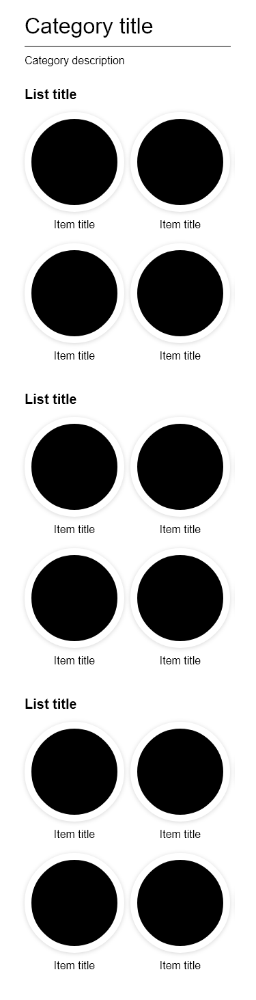
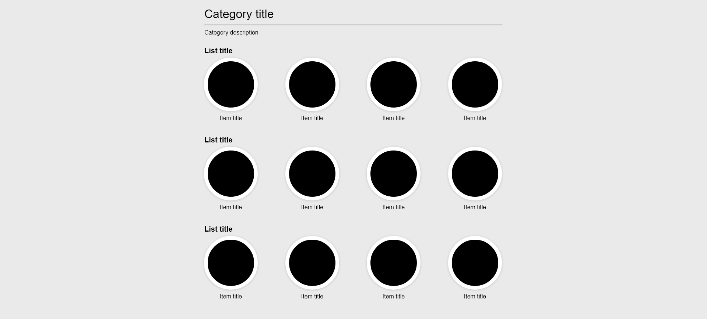

# Paf Frontend

Translate the design sketches ([small screens](#design-small-screens) & [large screens](#design-large-screens)) into a working prototype with HTML & CSS.

Leverage HTML to introduce meaning to the various elements of the design and CSS to produce the layout provided.

You are allowed to make adjustments to the layout if needed to support the minimum required screen widths ranging between 320-1920px.

 

### File structure
- **src/index.html** - The place for your HTML.
- **src/style.css** - The place for your CSS.
- **src/roundel.png** - The example image to use as the item image.

[Start a new codesandbox.io](https://codesandbox.io/s/github/johanwestling/paf-frontend-exercise-html-css)

 

## Design sketch - Small screens

 

## Design sketch - Large screens
